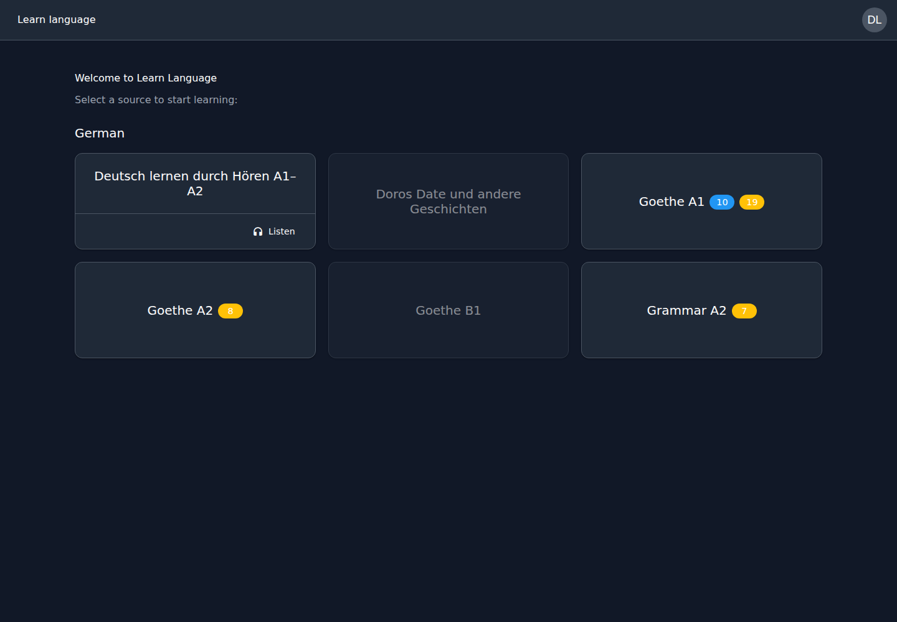
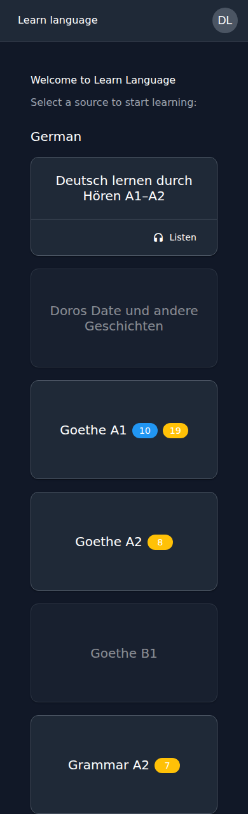
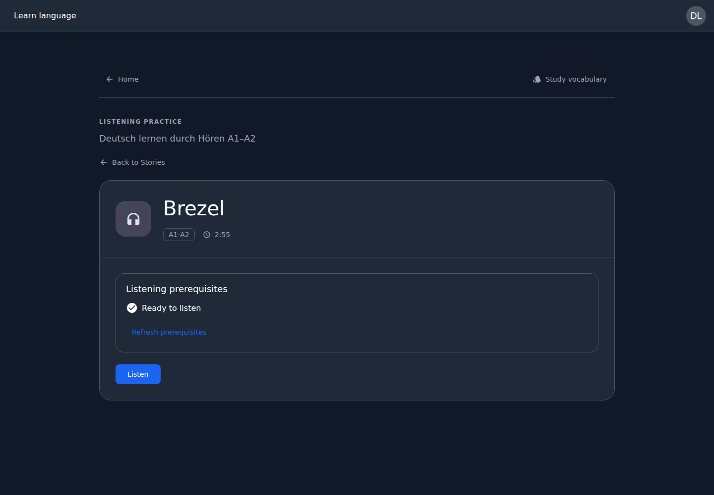
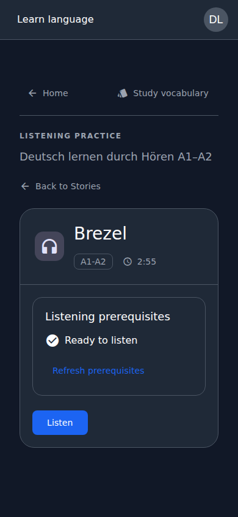
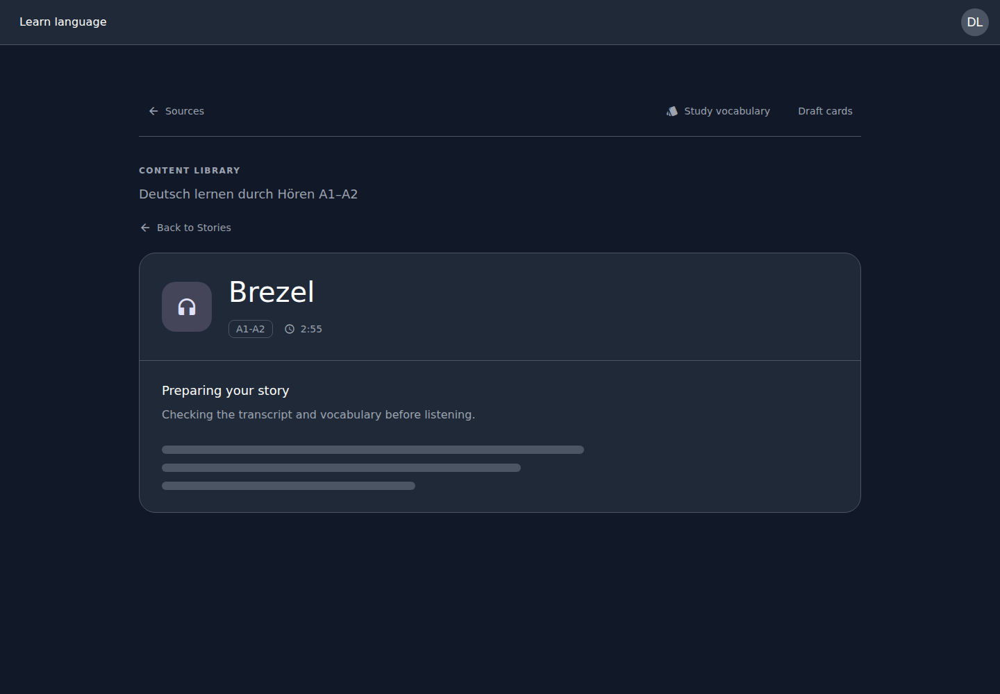
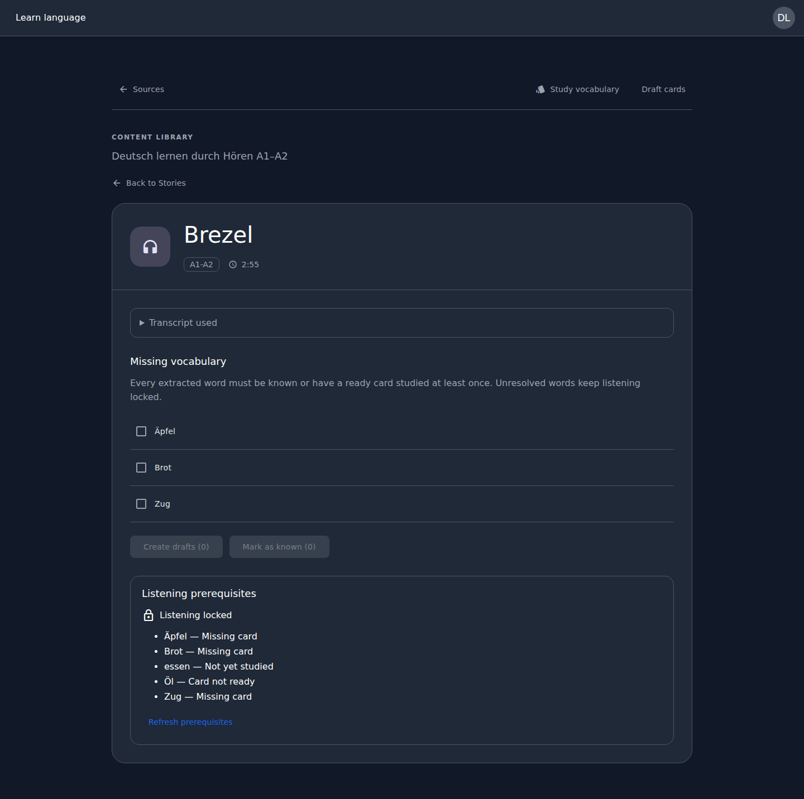
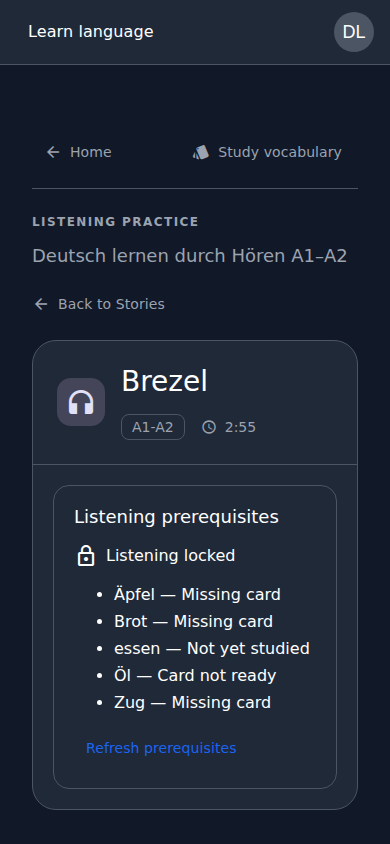

# Listening redesign previews

Captured from the Angular production build in Chromium using fixture API responses and a local preview session. These images show the rendered application, not a static mockup. They do not represent a full-stack E2E run.

- Desktop: 1440 × 1000 viewport
- Mobile: 390 × 844 viewport (full-page captures)
- Dark color scheme

## Home

## Story

## Preparation

## Alphabetical vocabulary

